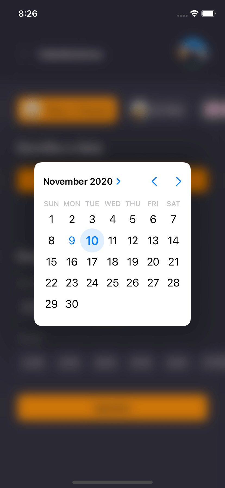
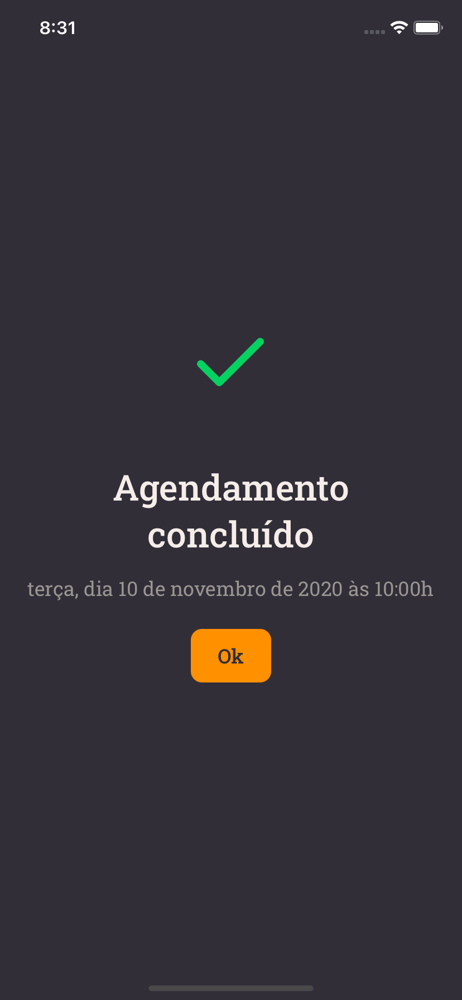

<h1 align="center">
  
</h1>

<h3 align="center">
  GoBarber - Mobile App
</h3>

<p align="center">
  <a href="https://www.linkedin.com/in/gustavo-tatarem/">
    
  </a>
  
  
  
  
  
  <a href="https://github.com/gustatarem/appgobarber/commits/master">
    
  </a>
  
  
</p>

<p align="center">
  <a href="#-sobre-o-projeto">Sobre o projeto</a>&nbsp;&nbsp;&nbsp;|&nbsp;&nbsp;&nbsp;
  <a href="#-tecnologias">Tecnologias</a>&nbsp;&nbsp;&nbsp;|&nbsp;&nbsp;&nbsp;
  <a href="#-configurando-o-ambiente">Configurando o ambiente</a>&nbsp;&nbsp;&nbsp;|&nbsp;&nbsp;&nbsp;
  <a href="#-screenshots">Screenshots</a>&nbsp;&nbsp;&nbsp;|&nbsp;&nbsp;&nbsp;
  <a href="#-license">License</a>
</p>

## 👨🏻‍💻 Sobre o projeto

O GoBarber é uma aplicação de agendamentos em barbearias, onde os usuários podem realizar agendamentos com prestadores de serviço através do app mobile e os prestadores de serviço têm acesso à sua agenda de atendimentos através do sistema web.

Este repositório possui o código referente ao app mobile da aplicação, onde o prestador de serviço pode criar uma conta, fazer login, visualizar todos os prestadores de serviço cadastrados e marcar um agendamento com o prestador desejado.
 
Para acessar a **api**, clique aqui: [GoBarber API](https://github.com/gustatarem/gostack-gobarber-backend)<br />
Para acessar a **versão web**, clique aqui: [GoBarber Web](https://github.com/gustatarem/gostack-gobarber-web)

## 🚀 Tecnologias

Tecnologias utilizadas no desenvolvimento do app.

- [ReactJS](https://reactjs.org/)
- [TypeScript](https://www.typescriptlang.org/)
- [React Native](https://reactnative.dev/)
- [React Navigation](https://reactnavigation.org/)
- [React Native Vector Icons](https://github.com/oblador/react-native-vector-icons)
- [UnForm](https://unform.dev/) [By Rocketseat](https://rocketseat.com.br/)
- [Yup](https://github.com/jquense/yup)
- [Styled Components](https://styled-components.com/)
- [Axios](https://github.com/axios/axios)
- [Eslint](https://eslint.org/)
- [Prettier](https://prettier.io/)
- [EditorConfig](https://editorconfig.org/)


## 💻 Configurando o ambiente

### Pré-requisitos

- Ter a [API](https://github.com/gustatarem/gostack-gobarber-backend) da aplicação rodando
- [Yarn](https://classic.yarnpkg.com/) ou [npm](https://www.npmjs.com/)

Clone o repositório usando o `git` ou faça o download no formato zip. 

```bash
# Vá até a pasta do projeto
$ cd appgobarber

# Instale as dependências
$ yarn

# Confira se o arquivo 'src/services/api.ts' possui o IP de conexão correto para sua API

# Para iniciar a aplicação, execute o comando abaixo
$ yarn start

# Se for rodar o projeto no android, execute o seguinte comando
# Obs: certifique-se de ter um dispositivo conectado ou um emulador aberto
$ yarn android

# Se for rodar o projeto no iOS, primeiro vá até a pasta /ios dentro do projeto
$ cd ios

# E execute o seguinte comando para instalar as dependências
$ pod install

# Assim que a instalação finalizar, é só executar o comando abaixo
$ yarn ios
```

## 🖥 Screenshots






## 📝 License

This project is licensed under the MIT License - see the [LICENSE](LICENSE) file for details.
